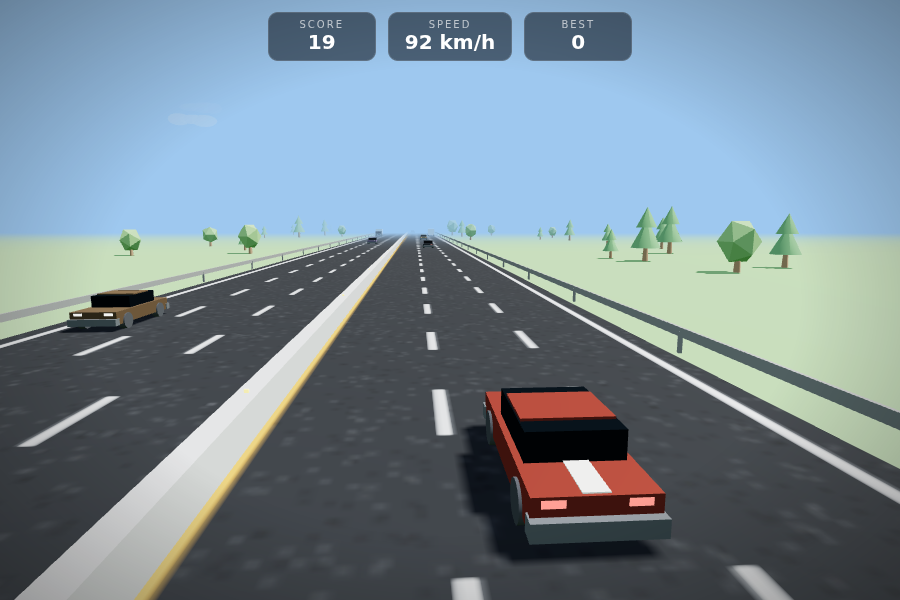

# Turbo Rush 3D 🏎️

An endless 3D highway driving game that runs in any modern browser.
No installs, no build tools — plain HTML, CSS, and JavaScript with
[three.js](https://threejs.org/) for the 3D graphics (already included
in `lib/`, so the game works fully offline).

## Play it

Double-click `index.html` — that's it.

(If your browser ever complains about local files, run a tiny server
instead: `npx serve` or `python3 -m http.server`, then open the printed
URL.)

## Controls

| Action | Keys | Touch |
|---|---|---|
| Steer | ← → or A / D | hold left / right half of the screen |
| Boost (rainbow trail!) | ↑ or W | — |
| Brake | ↓ or S | — |
| Drop oil slick | Space | 🛢️ button, bottom right |
| Horn — cars move over! | H | 📣 button, bottom right |
| Pause | P or Esc | — |
| Mute | M | — |

Pick your **car color** on the menu (it's remembered). Grab the
**🪙 coin rows** on the road (+25 each). Chain near-misses within 3
seconds for a **combo** (x2, x3…). Every run ends with a **driver
rank** — climb from ROOKIE RACER to TRAFFIC LEGEND.

Score = metres driven. Squeeze past a car with less than half a metre
to spare for a **NEAR MISS +100** bonus. Outrun a police chase — or
bait the cop into crashing — for **+500**. Your best score is saved in
the browser.

**Difficulties** (picked on the menu, remembered between visits):

| | EASY | NORMAL | HARD |
|---|---|---|---|
| starting speed | 72 km/h | 90 km/h | 108 km/h |
| top speed | 162 km/h | 230 km/h | 281 km/h |
| traffic | light | normal | dense |
| police | rare, timid | regular | frequent, aggressive |
| score multiplier | ×0.7 | ×1 | ×1.4 |

## How it works — a guided tour

All the game logic lives in `game.js`, split into numbered sections.
Read them in order and you'll know how to build a game like this
yourself.

### The big trick: the player never moves

The player car stays at `z = 0` forever. Instead, **the world moves
past it**: the road texture slides (`scrollWorld`), trees and guardrail
posts drift toward the camera and teleport back when they pass, and
NPC cars move at *relative* speed:

- same-direction traffic closes at `yourSpeed - theirSpeed`
- oncoming traffic closes at `yourSpeed + theirSpeed` (which is why it
  flies past)

This is how most endless runners work — it keeps every number small
and precise instead of racing coordinates off to infinity.

### The 3D scene (sections 3–4)

- A `PerspectiveCamera` chases the car, easing sideways as you steer
  and **widening its field of view at high speed** so speed feels fast.
- One directional "sun" light casts real shadows; fog fades the horizon
  and conveniently hides where NPCs spawn (300 m ahead).
- The road is a plain flat plane — all the detail (asphalt grain, lane
  dashes, the double yellow line) is a **canvas we paint once** and
  tile along the highway. Scrolling the texture offset makes the road
  "move".

### Cars are built from boxes (section 5)

`buildCar()` assembles a car from box and cylinder primitives: body,
glass cabin, bumpers, glowing head/tail lights, wheels with spokes that
visibly spin. There's a sedan and a truck variant. Geometry and most
materials are shared between all cars, and despawned NPCs go into a
pool for reuse — building cars from scratch every spawn would stutter.

### NPC drivers (section 6)

Each NPC is a little state bundle: lane, speed, blinker timer. Their
"AI" is three simple rules that add up to believable traffic:

1. **Lane discipline** — slow lane outside, fast lane by the median.
2. **Keep your distance** — if a car is < 14 m ahead in the same lane,
   ease off to match its speed (no NPC rear-endings).
3. **Change lanes sometimes** — if the target lane is clear, flash the
   blinker and slide over.

Spawning has a **fairness rule**: it never fills your last open lane,
so there is always a way through. Two more fairness rules protect you:
cars never merge into your lane right on top of you, and traffic
coming up behind you brakes instead of rear-ending you.

### The police and the wanted system (sections 6b–6c)

Every ~500 m a chase begins — siren wailing, light bars flashing.
Watch the **rear-view mirror** (a real second camera rendered at the
top of the screen) to see them coming. A chase can end three ways:

- a cruiser **rams or squeezes you** → BUSTED, run over;
- you **boost** and stay ahead until they give up → **+500**;
- a cruiser **crashes** — bait it into traffic or drop an **oil
  slick** (Space) in its path → **+500 each**.

Every chase you survive raises your **WANTED level (★–★★★)**, shown
in the HUD. At ★★ they send **two cruisers** — one rams from behind
while the other pulls alongside and squeezes you toward the barrier
(change speed to break the box). At ★★+ they also deploy **spike
strips** ahead of you: hit one and your tires blow — five seconds of
half steering and half speed while the cops close in.

At wanted ★★★ they call in **air support**: a police helicopter with
a sweeping searchlight, piloted by a **chunky black-and-white tuxedo
cat** (visible through the cockpit bubble — look up). Get caught in
the searchlight and the chase never times out; a radar jammer sends
the chopper wandering off your trail.

Power-ups float on the road:

- 🛢️ **oil barrel** — +1 oil slick (max 3 in stock)
- 🛡 **shield** — absorbs one traffic collision (not an arrest!)
- ⏱ **slow-mo ring** — the world runs at half speed for 4 s, your
  steering doesn't
- 📡 **radar jammer** — 7 s where cops can barely track you, the
  chopper loses you, and no spike strips get deployed

### Levels and weather

Every 1500 m you reach the next **LEVEL** (shown in the HUD): traffic
gets denser and the speed range climbs. **Rain showers** roll in from
time to time — visible rain, a darker and glossier wet road, rain
sound, and genuinely slippery steering until it passes.

### Collisions and the crash (section 10, `checkCollisions` + `crash`)

Collision detection is just axis-aligned box overlap in x/z, shrunk by
~30 cm so only real hits count. The crash itself is choreographed for
realism:

- a moment of **slow motion** on impact, then time speeds back up;
- your car **crumples** (a quick scale tweak), tumbles and is thrown;
- **debris** flies: loose wheels, the bumper, glass shards, sparks;
- an orange **fireball flash** (a point light), then drifting smoke;
- the car you hit is **shoved aside**, spins out and turns on its
  hazard lights;
- the world doesn't freeze — your wreck grinds to a halt while
  traffic brakes behind the crash and oncoming cars stream past;
- the sound is four layers: a deep thump, metal crunch, glass
  shatter, and a clunk when the wreck lands.

### Sound (section 8) — no audio files!

Everything is synthesized live with the Web Audio API: the engine is
two oscillators whose **pitch follows your speed**, and the crash is a
burst of white noise. `M` mutes.

### Day and night (section 4b)

A full day passes every 160 seconds: noon → sunset → night → dawn.
The cycle interpolates between keyframes (sky/fog color, sun color and
intensity, ambient light) and drives your **headlights** — a real
spotlight that fades in at night. The sky is a dome mesh rather than a
background color so the fog blends into it seamlessly.

### Dev cheats

Add URL parameters to jump straight to a situation while testing:
`index.html?wanted=3&copat=150&night=1` starts runs at wanted ★★★,
the first chase at 150 m, and at night. Others: `rain=1` (always
raining), `pickup=slow` (force one power-up type, spawned in your
lane), `coinlane=1` (coin rows in your lane), `lvlm=200` (metres per
level), `helicam=1` (camera follows the helicopter — say hi to
Officer Whiskers), `nomirror=1`.

### The loading screen

The world is generated by code, so there's nothing to download — the
loading bar tracks the real build steps (pave highway → build car →
hire NPC drivers) with a short delay per step so you can see it.

## Make it yours

All the knobs are constants at the top of `game.js`:

| Constant | What it does |
|---|---|
| `DIFFICULTIES` | the three presets: speeds, ramp, traffic, police, score multiplier — edit or add your own |
| `BOOST_MULT`, `BRAKE_MULT` | strength of ↑ / ↓ |
| `NPC_COLORS` | traffic paint jobs |
| `LANES`, `LANE_W` | width of the highway |
| `SKY` + the `Fog` line | time of day / weather mood |

Your car's color is set in `initPlayer()` (`0xd42a1e` — try `0x1e90ff`).
The game title lives in `index.html`.

## Ideas for the next version

- Replace box-cars with real 3D models (`GLTFLoader` + free models
  from [Kenney](https://kenney.nl/assets) or Sketchfab)
- Curved roads (bend the world sideways with a sine of distance) —
  the stepping stone toward driving real road shapes
- Real-world roads: Google Maps data can't be embedded in a game like
  this (licensing + online-only APIs), but **OpenStreetMap** data is
  free — once curved roads exist, a local road's shape could be
  imported as the track
- A magnet power-up that pulls pickups toward you
- The cat's backstory
